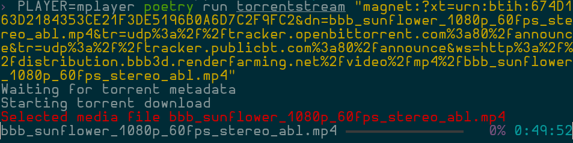

Libtorrent made easy
--------------------

This is pythonic high-level libtorrent API, inspired on the for-humans trend
set by Kenneth Reitz (https://github.com/not-kennethreitz).

TorrentStream is centered around the principle of `streaming` a torrent
(sequential download, buffering and playing).

|pypi| |release| |downloads| |python_versions| |pypi_versions| |coverage| |actions|

.. |pypi| image:: https://img.shields.io/pypi/l/torrentstream
.. |release| image:: https://img.shields.io/librariesio/release/pypi/torrentstream
.. |downloads| image:: https://img.shields.io/pypi/dm/torrentstream
.. |python_versions| image:: https://img.shields.io/pypi/pyversions/torrentstream
.. |pypi_versions| image:: https://img.shields.io/pypi/v/torrentstream

TorrentStream exposes a CLI command, intended as an example usage.

Torrent objects are context managers that can clean up torrent content after
you finish using them.

*add_torrent* method of a TorrentSession returns a Torrent object, thus can be
used directly as a context manager.

.. code:: python

    async def stream_torrent(hash_torrent):
        session = TorrentSession()

        # By default this will cleanup torrent contents after playing
        with session.add_torrent(magnet_link=hash_torrent, remove_after=True) as torrent:
            # Force sequential mode
            torrent.sequential(True)

            # Wait for torrent to be started
            await torrent.wait_for('started')

            # Get first match of a media file
            try:
                media = next(a for a in torrent
                             if a.is_media and not 'sample' in a.path.lower())
            except StopIteration:
                raise Exception('Could not find a playable source')

            with timeout(5 * 60):  # Abort if we can't fill 5% in 5 minutes
                await media.wait_for_completion(5)

            return await asyncio.gather(media.wait_for_completion(100),
                                        media.launch())
